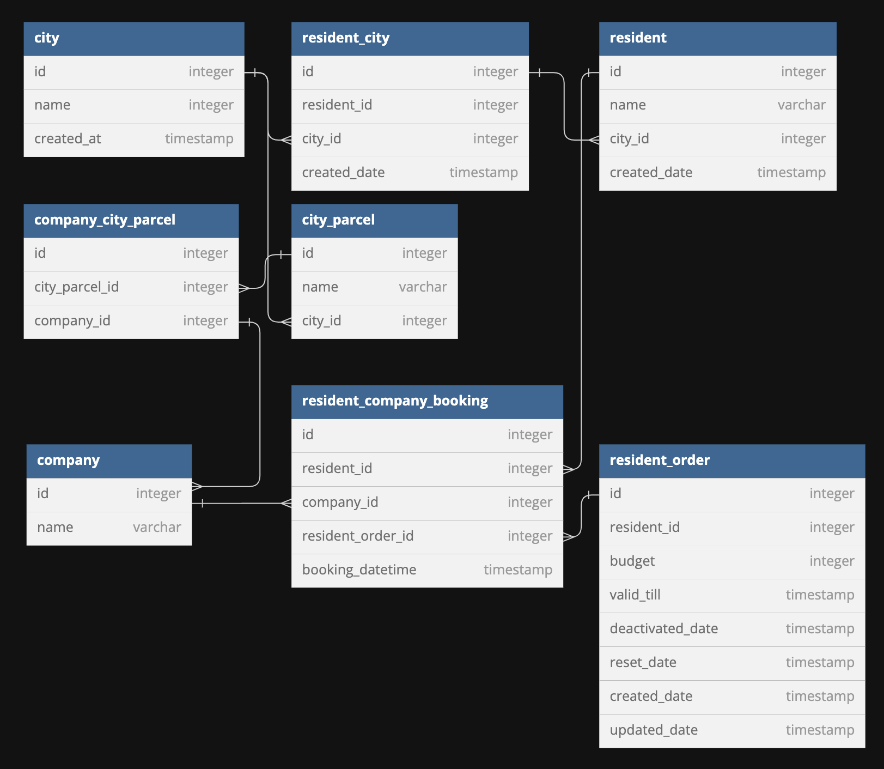

## PAQT Code Challenge
I've chosen the approach to showcase the workings of the code through unit tests.

To provide an easy setup and one that most are familiar with I've chosen to use Laravel Sail as a base.
Also opted to not disable any services provided by Laravel Sail to keep it as close as possible to the default.

### Challenge 1
Pretty straight forward challenge and well familiar with it.

Decided to make the variables for this challenge injectable.

Unit tests show the working of both FizzBuzz with the given numbers from the assignment and FooBarPun with the numbers 2 and 7.

### Challenge 2
Got to know your PHP functions for this.

Could have solved it in 1 line without using any classes but decided against that since we do OOP.

Unit tests provide cases for the numbers given from the assignment and 5.

### Challenge 3
Ah, DateTime. The source and frustration of every developer at one point in their lifetime.

This caught me in a bit of a doubt as to what solution I would write here. There are so many.
You can utilize generators, iterators, (while) loops or a combination of them all.
I've chosen for a simple while loop here to show that (while) loops are no issue either.
Also made it configurable on which day the week should start.
And, as per usual with DateTime calculations, provided a whole slew of tests for this.

### Challenge 4
For this challenge I've chosen to leave out the specific implementation of the service.

Instead, I made a database design and provided a bare-bone setup covered by interfaces.
This to show that;
 - I'm able to quickly provide translation of feature requests into an API.
 - Design code that takes into account the past, present and future.
 - Design code that follows SOLID principles and best practices such as TDD from the get go.
 - I'm able to provide a fairly basic setup where multiple members of a development team could work on the actual (service) implementation.
 - I'm able to work on one of, if not all, the (service) implementations.

I've specifically left out the unit tests for this too since I felt they would have added little value at this point,
 but one could easily test the controllers as they are with something like Mockery to test
 the interaction between the controllers and services.

This could also be extended to be a "Feature test" next to the Unit test to show interaction between the different layers of the application.
For example how the response is returned (JSON, XML, etc.), ACL interaction, request validation, etc.

_Note; design is not final but would be a starting point for discussions and/or implementation._

